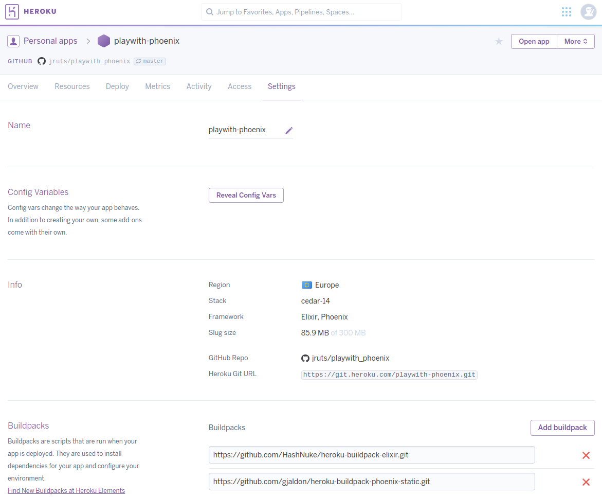
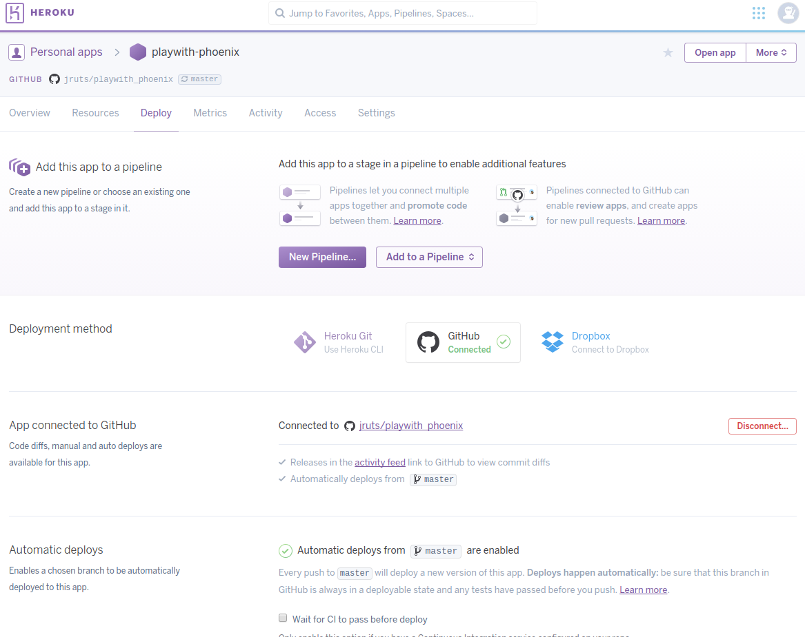
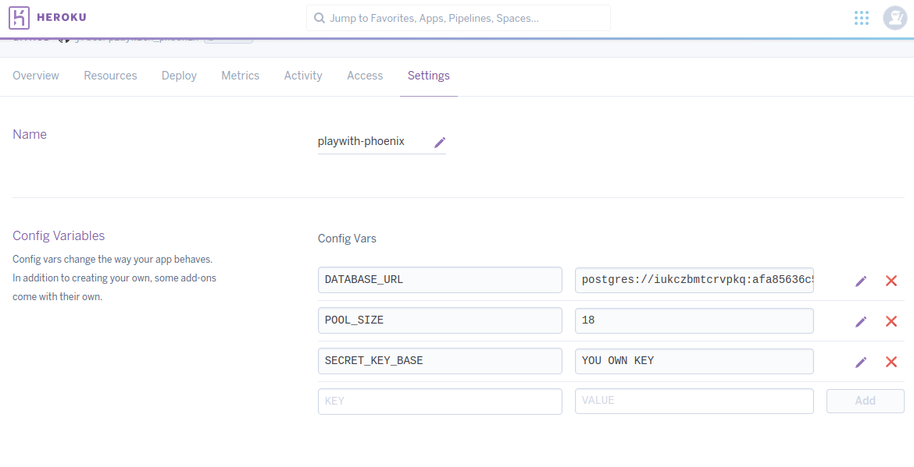
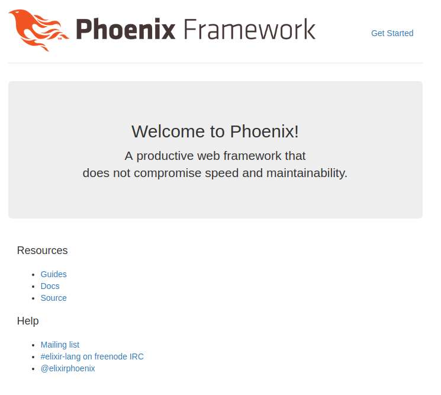

# Heroku Deployment

If you want to know how to deploy a phoenix app on the **Heroku** platform through the _Heroku cli_,
I suggest you to look at the official documentation on the [Phoenix website](http://www.phoenixframework.org/docs/heroku).

Some of the steps come from the documentation referenced above.

This documentation will guide you through how to setup a Phoenix application on Heroku through the Heroku dashboard.

## Setup through the Heroku dashboard.
### 1. Create a new application in the Heroku dashboard.


### 2. After the application has been created go to the _settings_ page and add following build packs:
  * `https://github.com/HashNuke/heroku-buildpack-elixir.git`
  * `https://github.com/gjaldon/heroku-buildpack-phoenix-static.git`



### 3. Connect your **git** repository to the Heroku application.
Click the _Deploy_ link in your app navigation and select **Github** as your deployment method.<br/>
You will have to authorize Heroku to access your git repositories.
You will be able to select the repository you want to connect and if you want to have an automatic build 
when changes are pushed to master.



### 4. Add a Postgres database to your Heroku application.

Depending on the need of your application to connect to a database and that Postgres is the default choice
of **Ecto**, we can add a Postgres database by just [installing the addon](https://elements.heroku.com/addons/postgres)
and connect it to your app. The only thing you need to do is to click the [Install Postgres](https://elements.heroku.com/addons/postgres) button.

Note that this installation will add the `DATABASE_CONNECTION` environment variable in your application settings.
We wills see more of that later on.

### 5. Make your Phoenix project Heroku-ready!
Now that the project has been set up in Heroku we still need to modify a few files in our Phoenix project
to get it ready for Heroku.

**Note:** if you copy paste pieces of the code examples, make sure adjust the project names.<br/>
*playwith_phoenix* needs to be your project and _PlaywithPhoenix_ needs to be changed accordingly.

First, let's make sure our secret key is loaded from Heroku's environment variables instead of 
`config/prod.secret.exs` by adding a `secret_key_base` in `config/prod.exs`:

```elixir
config :playwith_phoenix, PlaywithPhoenix.Endpoint,
  ...
  secret_key_base: System.get_env("SECRET_KEY_BASE")
  ...
```

Then we will add our database configuration to `config/prod.exs`:
```elixir
# Configure your database
config :playwith_phoenix, PlaywithPhoenix.Repo,
  adapter: Ecto.Adapters.Postgres,
  url: System.get_env("DATABASE_URL"),
  pool_size: String.to_integer(System.get_env("POOL_SIZE") || "10"),
  ssl: true
```

Then we will tell Phoenix to use our Heroku URL and enforce SSL:

```elixir
config :playwith_phoenix, PlaywithPhoenix.Endpoint,
  ...
  url: [scheme: "https", host: "your_heroku_app_name.herokuapp.com", port: 443],
  force_ssl: [rewrite_on: [:x_forwarded_proto]],
  ...
```

Since we use Heroku's environment variables we do not need to import `config/prod.secret.exs` anymore in `config/prod.exs`,
so we can just remove the following line:<br/>
`import_config "prod.secret.exs"`

Our `config/prod.exs` file should now look like this:
```elixir
use Mix.Config

# For production, we configure the host to read the PORT
# from the system environment. Therefore, you will need
# to set PORT=80 before running your server.
#
# You should also configure the url host to something
# meaningful, we use this information when generating URLs.
#
# Finally, we also include the path to a manifest
# containing the digested version of static files. This
# manifest is generated by the mix phoenix.digest task
# which you typically run after static files are built.
config :playwith_phoenix, PlaywithPhoenix.Endpoint,
  http: [port: {:system, "PORT"}],
  url: [scheme: "https", host: "your_heroku_app_name.herokuapp.com", port: 443],
  force_ssl: [rewrite_on: [:x_forwarded_proto]],
  cache_static_manifest: "priv/static/manifest.json",
  secret_key_base: System.get_env("SECRET_KEY_BASE")  

# Do not print debug messages in production
config :logger, level: :info

# Configure your database
config :playwith_phoenix, PlaywithPhoenix.Repo,
  adapter: Ecto.Adapters.Postgres,
  url: System.get_env("DATABASE_URL"),
  pool_size: String.to_integer(System.get_env("POOL_SIZE") || "10"),
  ssl: true
```

The last file we need to modify is `config/confix.exs`. This file will have your `secret_key_base`.
Take note (copy) of this key because we will added it to our Heroku environment variables in a bit, and replace it with `System.get_env("SECRET_KEY_BASE")`.

It should look like this:
```elixir
# Configures the endpoint
config :playwith_phoenix, PlaywithPhoenix.Endpoint,
  url: [host: "localhost"],
  secret_key_base: System.get_env("SECRET_KEY_BASE"),
  render_errors: [view: PlaywithPhoenix.ErrorView, accepts: ~w(html json)],
  pubsub: [name: PlaywithPhoenix.PubSub,
           adapter: Phoenix.PubSub.PG2]
 ```

 ### Add the environment variables.
 So the last thing that we need to do is add our `SECRET_KEY_BASE` enviroment variable and our database `POOL_SIZE`.<br/>
 Go to your Heroku application dashboard and go to _settings_.

 There you can _reveal_ your config vars and add them.



Note that the `DATABASE_URL` has been set by the postgres installation!

 ### FINISH: Merge to master!!
 When you merge a PR or push to _master_ Heroku will build and deploy your phoenix app.       



