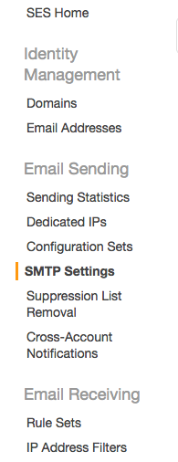
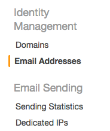

# Sending Emails using Amazon SES

## What we are going to do

We are going to build an application which sends an email using Amazon SES
using the SMTP interface described [here](http://docs.aws.amazon.com/ses/latest/DeveloperGuide/sending-email.html).
If you are looking to integrate emailing in your application, I would advise against immediately trying to integrate this in before having already created a throwaway application.

## Tools We are going to use

### Bamboo


Bamboo is an emailing library for Elixir built by [thoughtbot](https://thoughtbot.com/)

We will use the [SMTP adapter](https://github.com/fewlinesco/bamboo_smtp)

We are also going to use [mock](https://github.com/jjh42/mock) for stubbing our functions when testing

<br>

----

### Amazon SES


SES is an email service provided by Amazon

SES is reliable, affordable and has great documentation

<br><br><br>

## How we are going to do it

We will divide the setup into two sections, the SES setup and the Phoenix Application setup

#### Amazon SES Setup

First you will need to sign in to your amazon account [here](https://console.aws.amazon.com/ses/)

Once you are signed in you should see a nav bar on the left of the screen and click on SMTP settings



On this page make a note of your "Server Name" and "Port"

Then click 

Then on the bottom right of the screen click "Create"

Then click "Show User SMTP Security Credentials"

Make a note of your "SMTP Username" and "SMTP Password"

Next we need to authorise an email address for testing, return back to the [Ses dashboard](https://console.aws.amazon.com/ses/)

Click on "Email Addresses" under "Identity Management" on the nav bar on the left



Click  and type in a real email address which you will use for testing your application

Now go check your emails and click the validation link

Great you are now ready to start building the application.

Before continuing you should now have made a note of the following:
* Server Name
* Port
* SMTP Username
* SMTP Password
* The validated email address

We now have everything we need from AWS and can start building the application.

#### Phoenix Application

```bash
$ mix phoenix.new ses_email_test --no-ecto
("y" to Install dependencies)
$ cd ses_email_test
```
Check your server is running with:
```bash
$ mix phoenix.server
```
Then visiting `http://localhost:4000`

We'll need to install some dependencies to so inside of `mix.exs`.
Ensure to edit your `deps` and `application` functions as follows:

`mix.exs` (Add in :bamboo, :bamboo_smtp and :mock)
```elixir
defp deps do
  [{:phoenix, "~> 1.2.1"},
    ...
   {:bamboo, "~> 0.7"},
   {:bamboo_smtp, "~> 1.2.1"},
   {:mock, "~> 0.2.0", only: :test}]
end
```

`mix.exs` (Add in :bamboo)
```elxir
  def application do
    [mod: {SesEmailTest, []},
     applications: [:phoenix, :phoenix_pubsub, :phoenix_html, :cowboy, :logger, :gettext, :bamboo]]
  end   
```     

Now let's install our deps by running:
```bash
$ mix deps.get
```

Next we need to create a `Mailer` module for our application to use,
This will be where we reference the functions which `Bamboo` gives us.
Create a `mailer.ex` file inside of `lib/ses_email_test`

`lib/ses_email_test/mailer.ex`
```elixir
defmodule SesEmailTest.Mailer do
  use Bamboo.Mailer, otp_app: :ses_email_test
end
```

Next we need an `Email` module which will where we will keep our own helpers for sending emails.
Create a `email.ex` file inside of `lib`

`lib/email.ex`
```elixir
defmodule SesEmailTest.Email do
  use Bamboo.Phoenix, view: SesEmailTest.EmailView

  def send_test_email(to_email_address, from_email_address) do
    new_email()
    |> to(to_email_address)
    |> from(from_email_address)
    |> subject("Welcome!")
    |> text_body("Welcome")
  end
end
```

Now we need to set up our configuration our Mailer function
Add this to your `confix.exs` file

`config/config.exs`
```elixir
...
# Configure mailing
config :ses_email_test, SesEmailTest.Mailer,
  adapter: Bamboo.SMTPAdapter,
  server: System.get_env("SES_SERVER"),
  port: System.get_env("SES_PORT"),
  username: System.get_env("SMTP_USERNAME"),
  password: System.get_env("SMTP_PASSWORD"),
  tls: :always, # can be `:always` or `:never`
  ssl: false, # can be `true`
  retries: 1
...
```

Now we need to ensure to source these environment variables
Set up an `.env` file in the root of your application with the following

`.env`
```bash
export SMTP_USERNAME=<smtp_username>
export SMTP_PASSWORD=<smtp_password>
export SES_SERVER=<server_name>
export SES_PORT=<ses_port>
```

Now lets set up our email route by editing our `scope` function

`web/router.ex`
```elixir
scope "/", SesEmailTest do
  pipe_through :browser

  get "/", PageController, :index
  resources "/email", EmailController, only: [:index, :create]
end
```

Now lets set up our email controller
`web/controllers/email_controller.ex`
```elixir
defmodule SesEmailTest.EmailController do
  use SesEmailTest.Web, :controller

  def index(conn, _params) do
    render conn, "email.html"
  end

  def create(conn, %{"email" => %{"email_to" => email_to, "email_from" => email_from}}) do
    SesEmailTest.Email.send_test_email(email_to, email_from)
    |> SesEmailTest.Mailer.deliver_now()

    conn
    |> put_flash(:info, "Email Sent")
    |> redirect(to: email_path(conn, :index))
  end
end
```

Lets create the view
`web/view/email_view.ex`
```elixir
defmodule SesEmailTest.EmailView do
  use SesEmailTest.Web, :view
end
```

Now make the template
`web/templates/email/index.html.eex`
```elixir
<%= form_for @conn, forgotpass_path(@conn, :create), [as: :email], fn f -> %>
  <h6>Enter the email to send from:</h6>
  <div class="form-group">
    <%= label f, :email_from, class: "control-label" %>
    <%= text_input f, :email_from, placeholder: "email@example.com", class: "form-control" %>
  </div>
  <h6>Enter the email to send to:</h6>
  <div class="form-group">
    <%= label f, :email_to, class: "control-label" %>
    <%= text_input f, :email_to, placeholder: "email@example.com", class: "form-control" %>
  </div>
  <%= submit "Send", class: "btn btn-primary" %>
<% end %>
```

Now we can check if everything worked by starting our server `mix phoenix.server`
Then visiting `localhost:4000/email`

Put in the email address which you have validated

#### Testing

Now we are going to test our application create your test file

`test/controllers/email_controller_test.exs`
```elixir
defmodule SesEmailTest.EmailControllerTest do
  use SesEmailTest.ConnCase, async: false 

  test "/forgotpass :: index", %{conn: conn} do
    conn = get conn, forgotpass_path(conn, :index)
    assert html_response(conn, 200) =~ "Enter the email to send from"
  end

  test "/forgotpass :: create", %{conn: conn} do
    conn = post conn, email_path(conn, :create,
      %{"email" => %{"email_to" => <your_verified_email>, "email_from" => <your_verified_email>}})
    assert redirected_to(conn, 302) =~ "/forgotpass"
  end
end
```

And let's run it with: `mix test`
Great it worked, but it also sent us an email.
As it may get quite annoying to recieve emails every time you run your tests,
lets fix that with the mocking library we installed at the beginning.
Ensure to configure your tests to run asyncronously with `async: false` and adjust the second test as follows

`test/controllers/email_controller_test.exs`
```elixir
defmodule SesEmailTest.EmailControllerTest do
  use SesEmailTest.ConnCase, async: false 

  import Mock

  test "/forgotpass :: index", %{conn: conn} do
    conn = get conn, forgotpass_path(conn, :index)
    assert html_response(conn, 200) =~ "Forgotten Password"
  end

  test "/forgotpass :: create", %{conn: conn} do
    with_mock SesEmailTest.Mailer, [deliver_now: fn(_) -> nil end] do
      conn = post conn, forgotpass_path(conn, :create,
      %{"email" => %{"email_to" => <verified_email>, "email_from" => <verified_email>}})
      assert redirected_to(conn, 302) =~ "/forgotpass"
    end
  end
end
```

Now when running the test we checked everything as we did before, but no email was sent,
that is because we stubbed out our `deliver_now` function to not do anything
Note that when testing your application manually, emails will still send

#### Moving out of testing environment

So after testing your application you will probably want more freedom to send emails to whoever you want without having to verify each email address
To do so you will need to Increase your SES Sending Limits

This can be done by opening a case by following the instructions [here](http://docs.aws.amazon.com/ses/latest/DeveloperGuide/request-production-access.html)
After your case has been approved by Amazon, you will now have freedom to send emails to whoever you want


